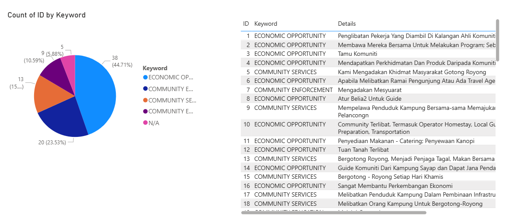

# COBT Power BI Project

The purpose of this project is to create a dashboard using PowerBI as one of the requirement for my class project.

The project uses data from Sabah Tourism Board

### Objective
1. **Dataset creation** using the provided dataset for further cleaning 
2. **Preprocessing** of the dataset, extraction of basic information, and informative visualizations.
3. **Usage of python scripting** in data transformation

# Part 1: Dataset creation
Dataset provided is stored in ```.csv``` file and the following information is extracted

- **Sustainability Practices:** How to ensure the community-based tourism initiative can help increasing sources of income of your community
- **Partnership and Collaboration:** Does a partnership or collaboration has been established
- **Marketing:** How does the marketing and promotion work
- **Future Plans:** Any planning or goal for further improvement
- **Community Engagement:** How is the local community involvement
- **Feedback:** Customer satisfaction
- **Operators:** Tourism-board operator (based on district)
- **Service:** Services provided in each tourism spot
- **Expenses:** Income and expenses for each tourism spot (Estimation/Average)

# Part 2: Preprocessing, analysis, visualizations
In this second part of the project, additional cleaning and visualization techniques are applied to gain a deeper understanding of the dataset.

Three python script are used in this phase: ```remove_stopwatch.py```, ```remove_stopwords.py``` and ```replace_synonyms.py```

## Data Preprocessing
### 1. remove_stopwatch.py
We processes a text column in a dataset, removing common stopwords (like "the", "is", "in") plus some additional ones (especially in Malay), and stores the cleaned version in a new column.
```
import pandas as pd
import nltk
from nltk.corpus import stopwords

# Download NLTK data (if not already downloaded)
nltk.download('stopwords')
nltk.download('punkt')

# Define custom stopwords (mostly Malay + numbers)
additional_stopwords = set([
    'dan', 'dalam', 'untuk', 'yang', 'ada', 'kepada', 'seperti', 'adalah', 'dengan', 'atau', 'ini', 'di',
    'ya', 'sabah', 'juga', 'oleh', 'akan', 'pada', 'dari', 'daripada', 'lain', 'melalui', 'lebih', 'kami', 'sangat',
    'masih', 'tidak', 'kurang', 'tiada', 'mereka', 'ialah', 'itu', 'kerana', 'ianya', 'lagi', 'mana',
    'terdapat', 'bagi', 'termasuk', 'boleh', 'harus', 'ia', 'sekitar', 'banyak', 'saya',
    'anda', 'kita', 'setiap', 'serta', 'sebuah', 'pelancongan', 'pelancong', 'ke', 'sentiasa', 'pengunjung',
    'produk', 'kawasan', 'baru', 'menawarkan', 'meningkatkan', '1', '2', '3', '4', '5', '6', '7', '8', '9', '0'
])

# Combine with English stopwords
combined_stopwords = set(stopwords.words('english')).union(additional_stopwords)

# Remove stopwords
dataset['without stopwords'] = dataset['Community Engagement'].apply(
    lambda x: ' '.join([word for word in x.split() if word.lower() not in combined_stopwords])
)
```

2. remove_stopwords.py 
We removes punctuation from each entry in the new column of the dataset.
```
import string

# Define punctuation and translation table
punct = '!"#$%&\'()*+,-./:;<=>?@[\\]^_`{}~'
transtab = str.maketrans(dict.fromkeys(punct, ''))

# Remove punctuation from text
dataset['without stopwords'] = '|'.join(dataset['without stopwords'].tolist()).translate(transtab).split('|')

```


3. replace_synonyms.py 
We words in the cleaned text to their standard synonyms, so related terms (like "program", "projek", "inisiatif") are treated the same in analysis.
```
import pandas as pd

# Define synonym dictionary
synonym_dict = {
    'sumber': 'pendapatan', 'income': 'pendapatan', 'perolehan': 'pendapatan',
    'inisiatif': 'inisiatif', 'program': 'inisiatif', 'projek': 'inisiatif',
    'usaha': 'usaha', 'cuba': 'usaha', 'ikhtiar': 'usaha',
    'cabaran': 'cabaran', 'halangan': 'cabaran', 'kesukaran': 'cabaran',
    'komuniti': 'komuniti', 'masyarakat': 'komuniti',
    'kerjasama': 'kerjasama', 'perkongsian': 'kerjasama',
    'keuntungan': 'keuntungan', 'manfaat': 'keuntungan',
    'maklum balas': 'maklum balas', 'ulasan': 'maklum balas',
    'promosi': 'promosi', 'pemasaran': 'pemasaran',
    'strategi': 'strategi', 'rancangan': 'rancangan', 'sasaran': 'sasaran'
}

# Replace words using the synonym dictionary
def replace_with_synonyms(text):
    words = text.split()
    return ' '.join([synonym_dict.get(word, word) for word in words])

dataset['improved'] = dataset['without stopwords'].apply(replace_with_synonyms)

```

# Data Visualization
### The dashboard


The dashboard is to summarize each tourism-spot data. 
There are few button ```Accomodation```, ```Guided Tours```, ```Handicraft```, ```Outdoor Activities``` and ```Cultural Experience``` for navigation. This is the sample page for each button.

### Navigation page


Each navigation page include
- Customer satisfaction
- Marketing wordcloud
- Collaboration wordcloud
- Monthly income and expenses

### Community Engagement page


In this diagram, we can see the percentage of community engagement within each tourism spot

### Profit page


In this diagram, slider is use to simulate the income for each tourism spot

### Plan page


In this diagram, we can see the future plan for each tourism-spot
